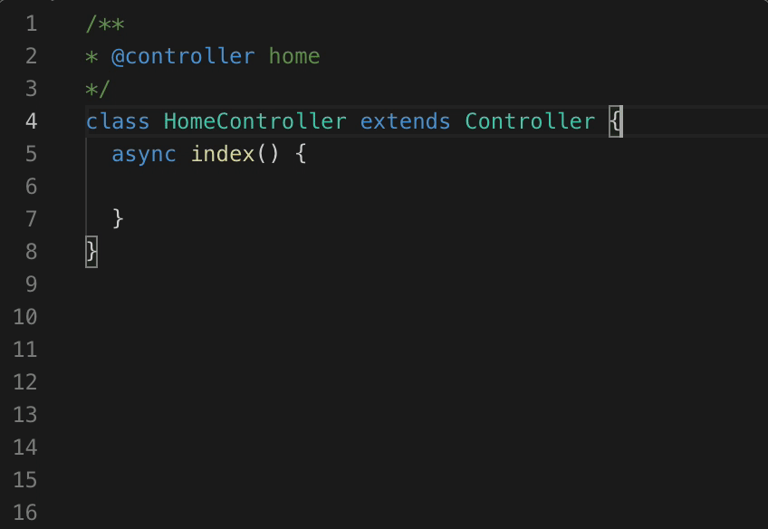
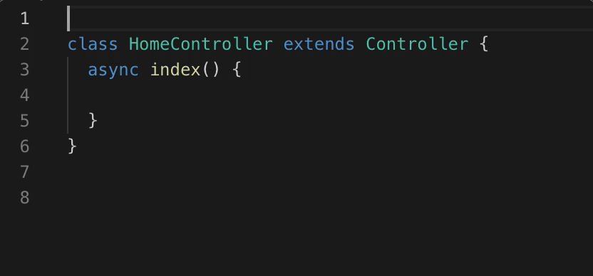
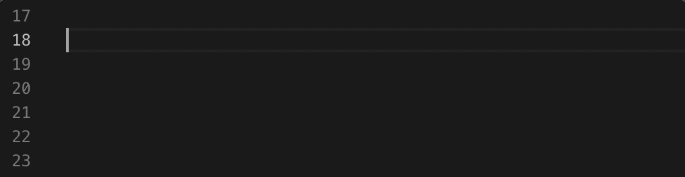

# swagger-doc-snippets

this extension is code snippets for [swagger-doc](https://github.com/Ysj291823/egg-swagger-doc#readme).

## Supported Snippets

### swagger doc

### swagger controller

### swagger contract

### swagger contract field

## Known Issues

Nothing now.

## Release Notes

### 0.0.1

Initial release of ...
